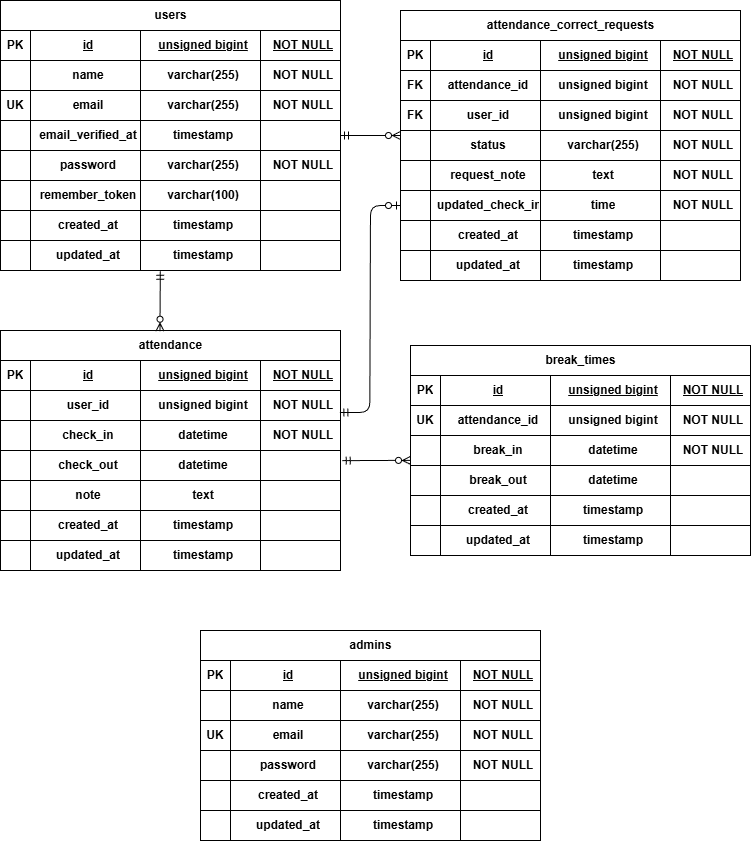

# attendance-app(勤怠管理アプリ)

## 使用技術
* Laravel 12.55.1
* PHP 8.2
* MySQL 8.0
* nginx1.21.1
* Docker 28.3.3
* MailHog (メール認証用)

## Dockerビルド
git clone https://github.com/yuno-zawa/attendance-app.git
cd attendance-app
docker compose up -d --build

## Laravel環境構築
docker compose exec php bash
cp .env.example .env
composer install
php artisan key:generate
php artisan migrate
php artisan db:seed

### ログイン情報
環境構築の手順にて`php artisan db:seed`を実行することで、以下のテスト用アカウントが作成されます。

一般ユーザー
* メールアドレス: user@example.com
* パスワード: password

管理者ユーザー
* メールアドレス: admin@example.com
* パスワード: password

## 開発環境URL
* 開発環境：http://localhost
* phpMyAdmin：http://localhost:8080
* MailHog：http://localhost:8025

## ER図

## テスト実行方法
docker compose exec php bash
php artisan test

## テストケース一覧
テストケースの詳細は以下のスプレッドシートを参照してください。
https://docs.google.com/spreadsheets/d/1GUD_MO60p18fCJmjnJ287_pSp07ra0780l_u4yCwW7E/edit?gid=1998718085#gid=1998718085